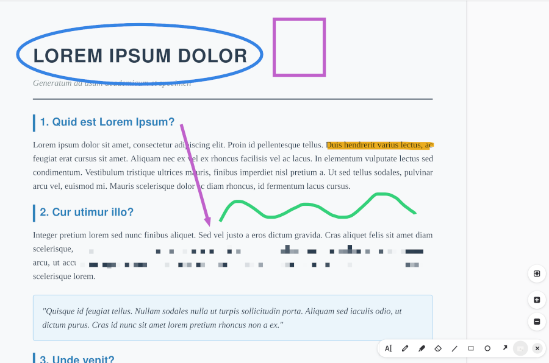

# Document Viewer

Papers is a document viewer capable of displaying multiple and single
page document formats like PDF and DejaVu.  For more general
information about Papers and how to get started, please visit
[https://welcome.gnome.org/app/Papers](https://welcome.gnome.org/app/Papers)

This is the fork of https://github.com/GNOME/papers/ . I added annotation tools:
draw, shapes, blur and text! Which are missing in the original while I needed them very much.



## Installation

To build
```
ninja -C build
```

To install
```
sudo ninja -C build install
```

## License

Papers is licensed under the [GPLv2](COPYING).

## Contribute

When interacting with the project, the [GNOME Code Of Conduct](https://conduct.gnome.org/) applies.

